[spring-cloud-loadbalancer](https://www.baeldung.com/spring-cloud-load-balancer)


代码中使用了负载均衡[ClientApplication](spring-cloud-loadbalancer-client/src/main/java/com/baeldung/spring/cloud/loadbalancer/client/ClientApplication.java)

```java
@SpringBootApplication
public class ClientApplication {
    public static void main(String[] args) {

        ConfigurableApplicationContext ctx = new SpringApplicationBuilder(ClientApplication.class)
                .web(WebApplicationType.NONE)
                .run(args);

        WebClient loadBalancedClient = ctx.getBean(WebClient.Builder.class).build();

        for(int i = 1; i <= 10; i++) {
            String response =
                loadBalancedClient.get().uri("http://example-service/hello")
                    .retrieve().toEntity(String.class)
                    .block().getBody();
            System.out.println(response);
        }
    }
}

```
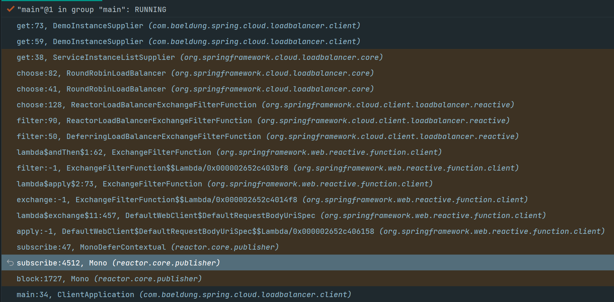

1. block:1727, Mono (reactor.core.publisher) 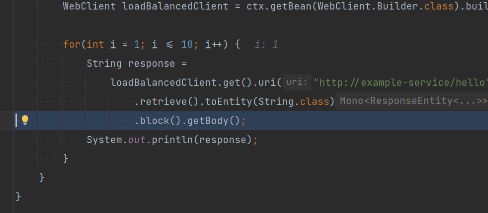

2. block:1727, Mono (reactor.core.publisher) 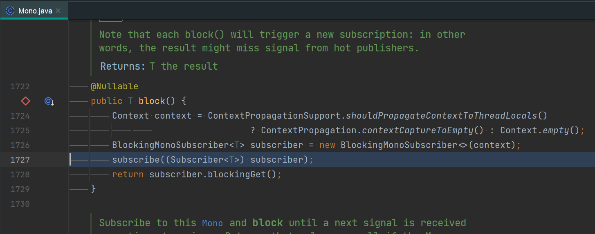
3. subscribe:4512, Mono (reactor.core.publisher)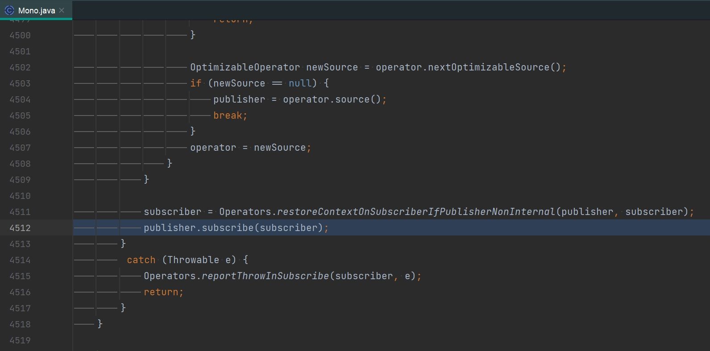
4. subscribe:47, MonoDeferContextual ;apply:-1, DefaultWebClient$DefaultRequestBodyUriSpec$$Lambda/0x000002652c406158 (org.springframework.web.reactive.function.client)(reactor.core.publisher)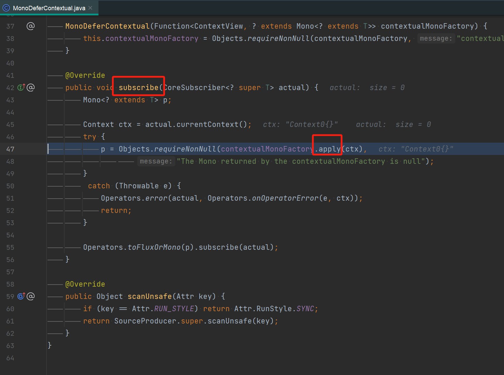
5. lambda$exchange$11:457, DefaultWebClient$DefaultRequestBodyUriSpec (org.springframework.web.reactive.function.client) 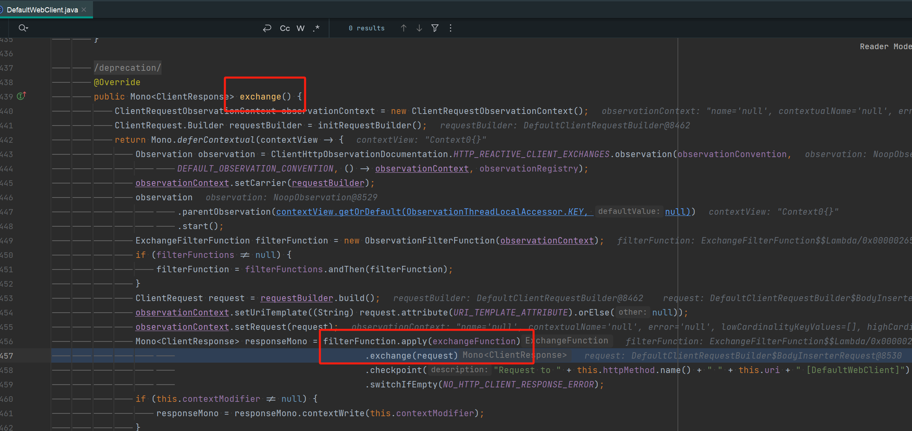
6. filter:50, DeferringLoadBalancerExchangeFilterFunction (org.springframework.cloud.client.loadbalancer.reactive)
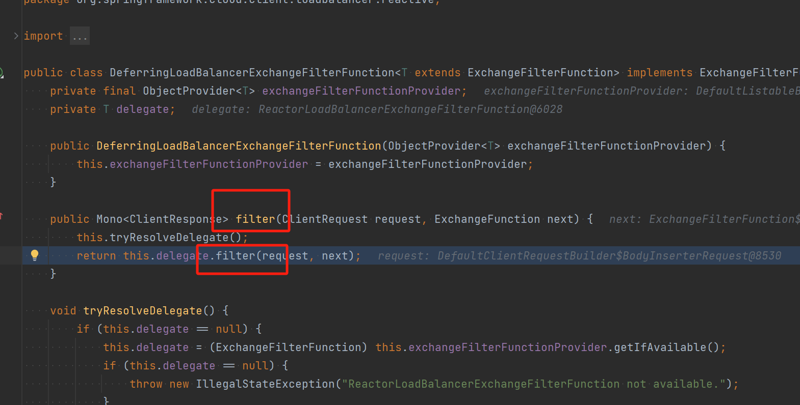

7. filter:90, ReactorLoadBalancerExchangeFilterFunction (org.springframework.cloud.client.loadbalancer.reactive) 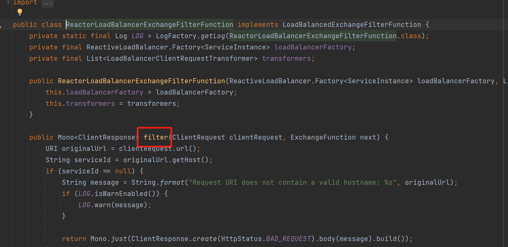

8. choose:128, ReactorLoadBalancerExchangeFilterFunction (org.springframework.cloud.client.loadbalancer.reactive)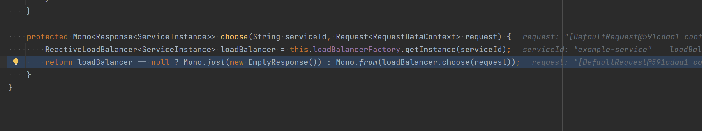

9. choose:82, RoundRobinLoadBalancer (org.springframework.cloud.loadbalancer.core) 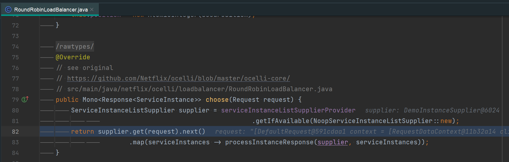

10. get:38, ServiceInstanceListSupplier (org.springframework.cloud.loadbalancer.core) 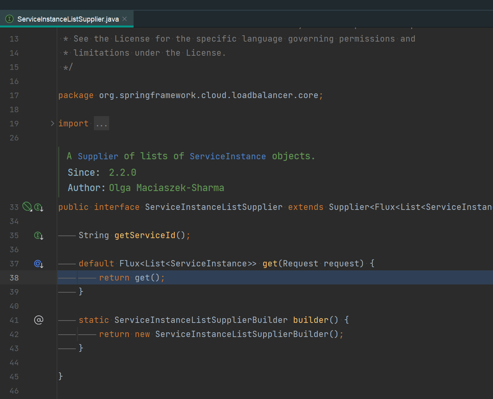